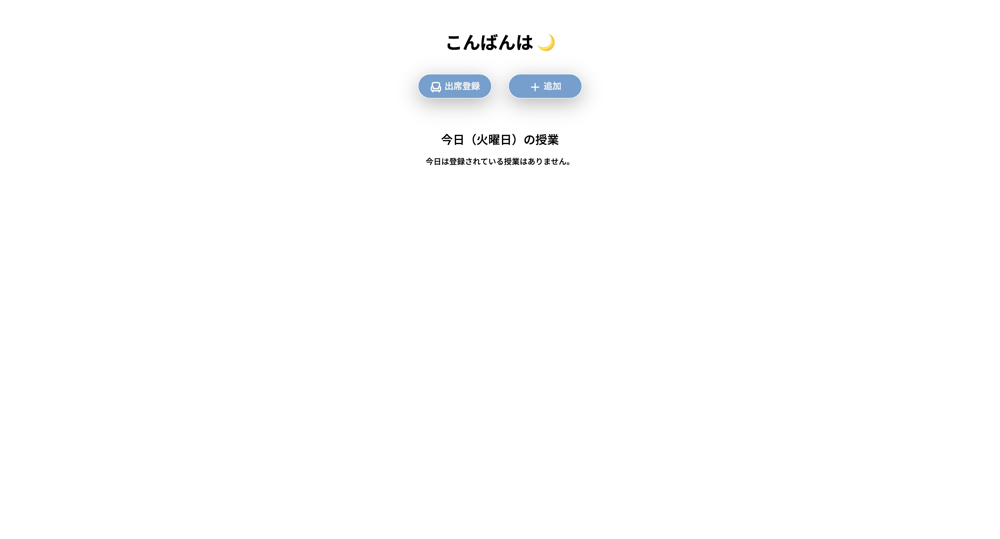
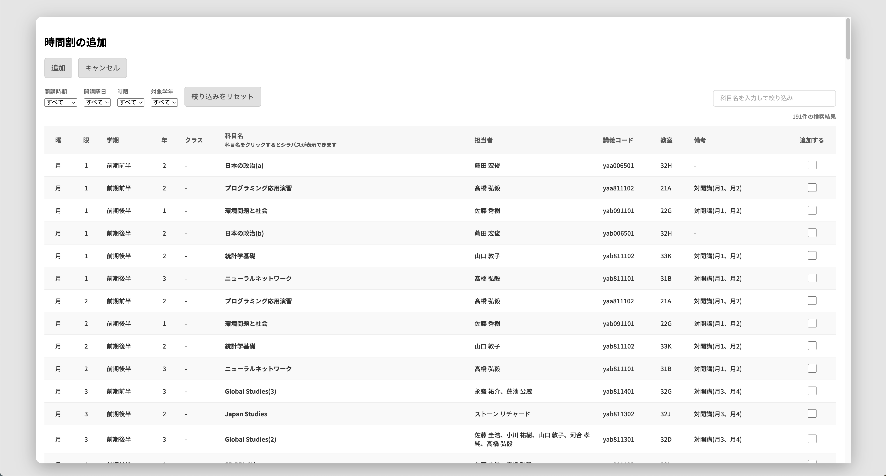

# README: tcu-course-sp

## Overview

This is a web application for managing and displaying class schedules. It allows users to view their timetable, search for classes, and see detailed information about each classes.

## Screenshots

## Features

- Designed for TCU the facility of Design and Data Science students
- View Timetable
- Search Classes
- Detailed Class Information
- Responsive Design for Mobile and Desktop
- Make your own timetable from syllabus data

## Roadmap 🚗

- [ ] Filter function
  - [ ] `開講時期`
  - [ ] `開講曜日`
  - [ ] `時限`
  - [ ] `対象学年`

- [ ] Search function

- [ ] Attendance Records

- [ ] Prevent selecting classes during the same time slot

## How to use

Access to the following URL. 
[https://rea-sna.github.io/tcu-course-sp/](https://rea-sna.github.io/tcu-course-sp/)

## License

This repository is protected by copyright.
Unauthorized reproduction of timetable data is prohibited.
